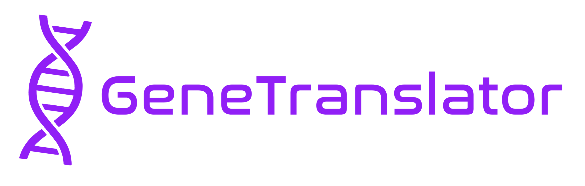
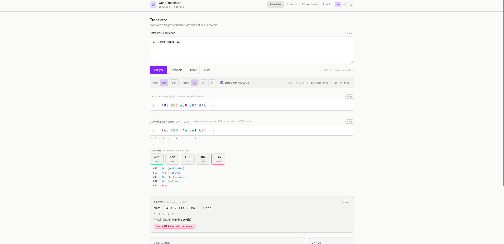

# GeneTranslator

Translate nucleotide sequences into protein. RNA → complementary DNA (cDNA) → codons → amino acids → protein, or DNA → RNA transcript → codons → protein, visualized as a step-by-step biological pipeline in a research-grade interface with light/dark themes and English/French UI.

## Screenshots


## Features

- RNA/DNA input toggle: RNA editor (A/U/G/C) or DNA coding-strand editor (A/T/G/C, transcribed T→U)
- Step-by-step pipeline: RNA (5′→3′) → cDNA (3′→5′) → codons → protein; DNA mode shows DNA → RNA transcript → codons → protein
- Per-nucleotide coloring, hover a codon to highlight its bases in both strands
- Codon tooltips: codon, amino acid, abbreviation, start/stop/normal, tRNA anti-codon
- ORF mode (start at first AUG, stop at first stop) + raw-frame mode
- Reading frames +1 / +2 / +3 with live re-analysis
- Full 64-codon searchable table; click a codon to demo it in the Translator
- Statistics: length, GC/AU content, codon count, protein length, start/stop, molecular weight
- Export protein as FASTA / TXT / JSON; copy buttons for input strand, second strand, protein
- Shareable URL hash, localStorage persistence, toasts, Ctrl/⌘+Enter shortcut
- Light/dark themes (dark default, OS preference respected, persisted toggle)
- English/French UI toggle (persisted, sets `lang` attribute)
- Animated pipeline: staggered codon pop-in, letter-by-letter protein assembly, flow pulses, typewriter example placeholder
- Responsive, keyboard-accessible, honors `prefers-reduced-motion`

## Installation

Requires Node.js 20+.

```bash
cd gene-translator
npm install
npm run dev
```

## Usage

1. Paste an RNA sequence, e.g. `AUGGCCAUUGUAUAA`.
2. Pick a reading frame and ORF mode.
3. Press **Analyze** (or Ctrl/⌘+Enter).
4. Hover codons to cross-highlight strands; export via FASTA/TXT/JSON.

## Exercise page

The Exercise tab compares two DNA alleles (normal vs mutant) through transcription, translation, automatic mutation classification (silent, missense, nonsense, insertion, deletion, frameshift), premature stop detection, a student-language analysis, and a copyable exam answer. Try Load Example: normal `CTT CTA CAA GGA ACC TAT TGT ATT` vs mutant `CTT CTA CAA GGA ACC TAT TTG ATT` (template strand) yields Thr → Asn, missense.

## Biological explanation

Two distinct processes are modeled (plus transcription in DNA mode):

- **Reverse transcription (RNA → cDNA):** template pairing, A→T, U→A, G→C, C→G. This is not translation.
- **Transcription (DNA → RNA):** the coding strand is transcribed by replacing T with U.
- **Translation (mRNA → protein):** triplets (codons) map to amino acids via the standard genetic code. Translation initiates at the start codon `AUG` (methionine) and terminates at the first stop codon (`UAA`, `UAG`, `UGA`).

Reading the same sequence from offset 0, 1, or 2 yields different codons - hence frames +1/+2/+3.

## Tech stack

React 19 · TypeScript · Vite · Tailwind CSS v4 · Vitest

## Project structure

```text
src/
├── lib/
│   ├── genetic-code.ts   # 64-codon table, start/stop, anti-codons
│   ├── biology.ts        # normalize/validate/rnaToDNA/dnaToRNA/split/translate/GC/analysis
│   ├── biology.test.ts   # 30 tests
│   ├── exercise.ts       # allele comparison, mutation detection/classification, exam answer
│   ├── exercise.test.ts  # 25 tests
│   └── export.ts         # FASTA/TXT/JSON + download
├── components/           # Header, SequenceEditor, SequenceDisplay, CodonCard,
│                         # TranslationResult, StatisticsPanel, CodonTable, ExportControls, Toast
│                         # exercise/      # ExerciseInput, SequenceComparison, TranscriptionComparison,
│                         #                # CodonComparison, ProteinComparison, MutationAnalysis,
│                         #                # ExerciseSummary, ExamAnswer
└── pages/                # TranslatorPage, ExercisePage, CodonTablePage, AboutPage
```

Biology logic lives only in `src/lib/` - components never implement the genetic code.

## Testing

```bash
npm test        # vitest run
npm run build   # typecheck + production build
```

Covers: valid/invalid RNA and DNA, lowercase, whitespace, start/stop codons, all 64 codons, frames +1/+2/+3, empty input, non-triplet length, GC calculation, RNA→cDNA pairing, DNA→RNA transcription, full analysis composition in both modes.

## Android build

The app ships as a native Android APK via Capacitor (web UI in `dist/` wrapped in a WebView, fully offline).

Prereqs: Android SDK (platform 35+, build-tools) and a JDK. This repo was built with Temurin JDK 17/21 unpacked to `~/.local/share/java` (no root needed):

```bash
export JAVA_HOME=~/.local/share/java/jdk-21.0.12.1+1
export ANDROID_HOME=~/Android/Sdk ANDROID_SDK_ROOT=~/Android/Sdk
```

Build a debug APK:

```bash
npm run build
npx cap sync android
./gradlew assembleDebug   # run inside android/
adb install android/app/build/outputs/apk/debug/app-debug.apk
```

App ID `com.besafewithsamy.genetranslator`, version 1.0.0 (versionCode 1). On Android, FASTA/TXT/JSON export saves to cache and opens the system share sheet (Blob download does not work in a WebView). Launcher icons are generated from `public/favicon.svg`.

## License

MIT
